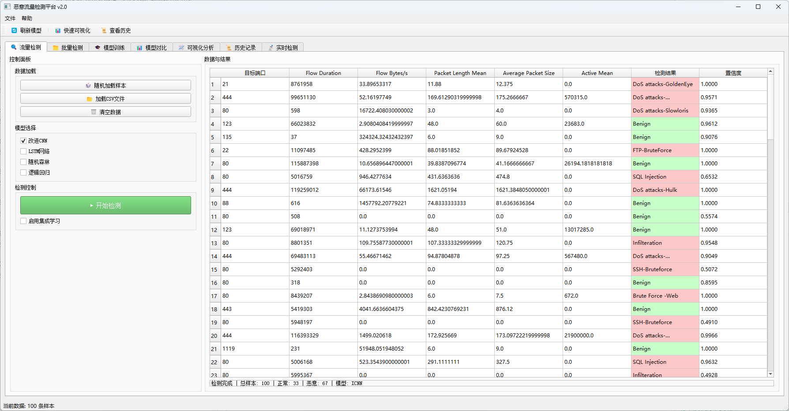
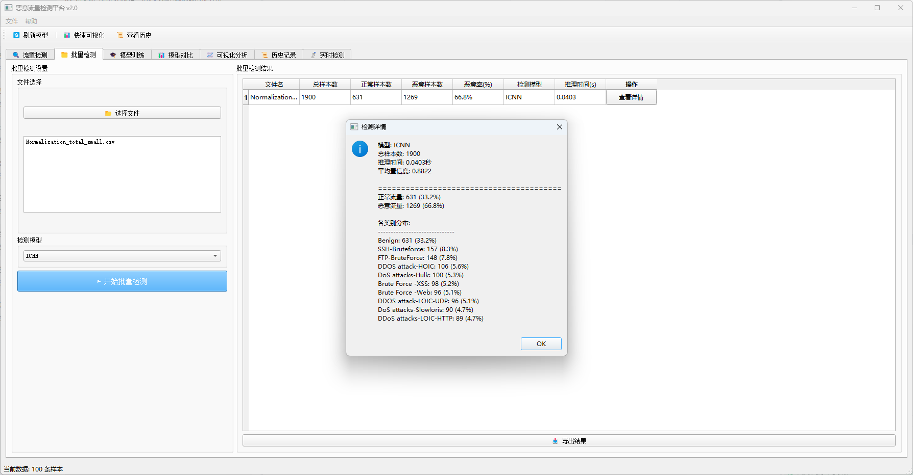
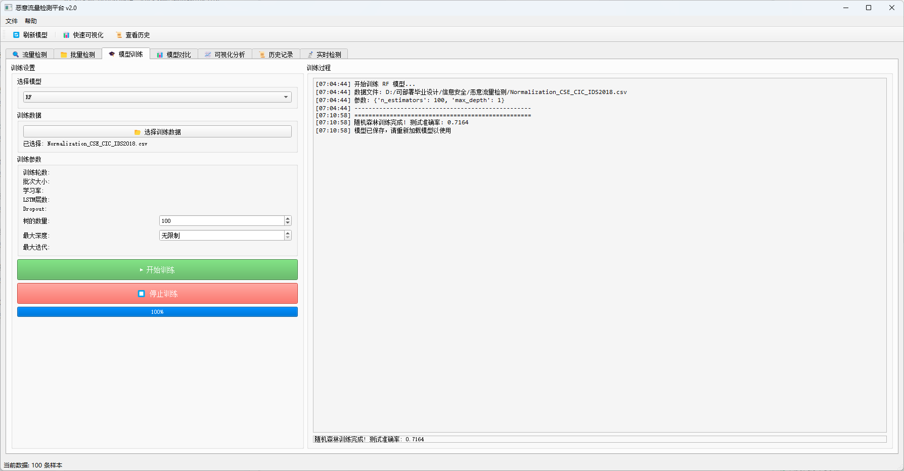
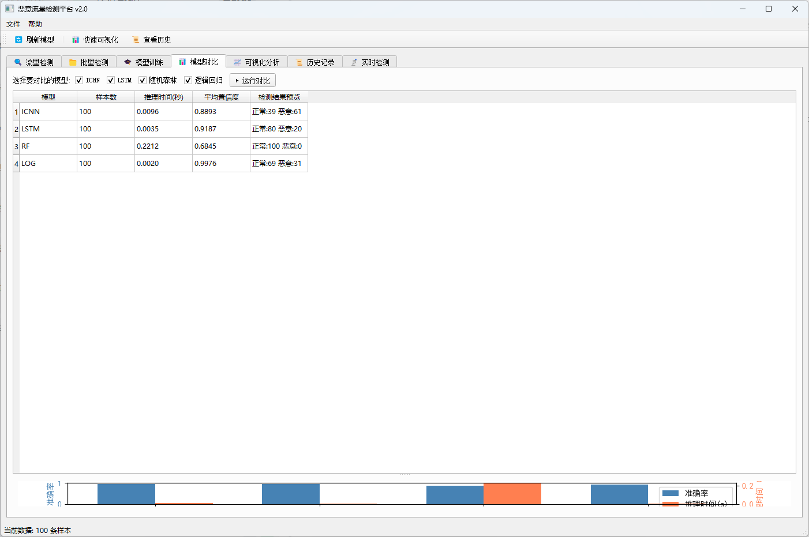
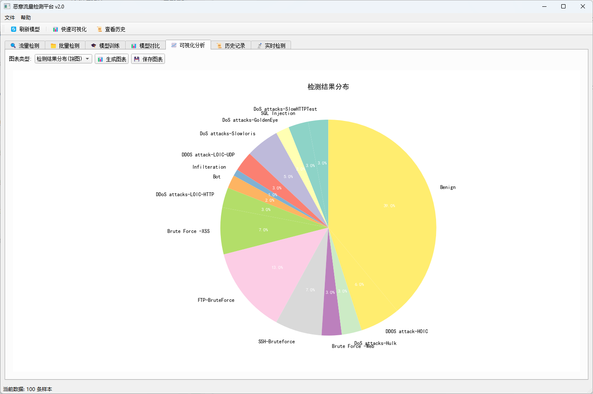
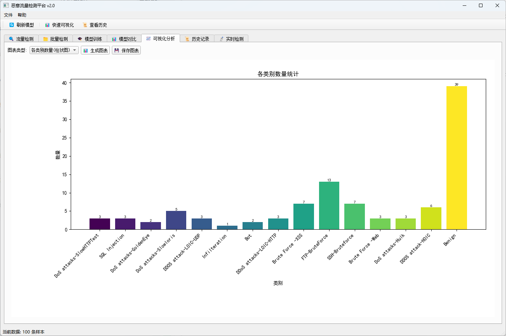
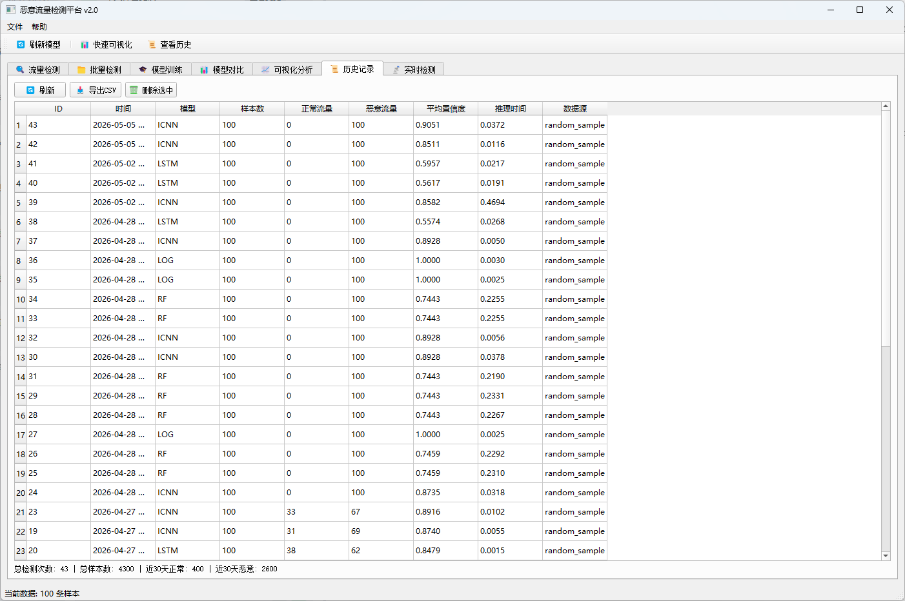
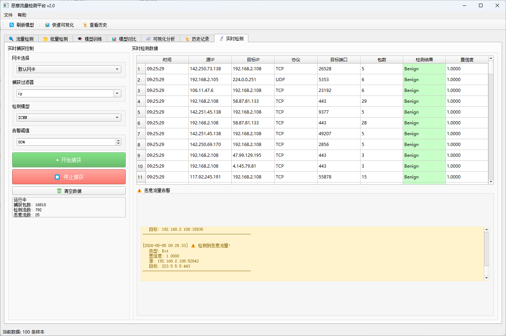

# 恶意流量检测系统 - 项目说明
# 源码获取：https://mbd.pub/o/bread/YZWclJxqZg==
## 一、项目概述

### 1.1 项目名称
**基于深度学习的恶意流量检测平台 v2.0**

### 1.2 项目简介
本项目是一个基于Python开发的恶意网络流量检测系统，采用深度学习（CNN、LSTM）与传统机器学习（随机森林、逻辑回归）相结合的混合架构，通过PyQt5构建可视化操作界面，支持离线数据检测和实时网卡流量捕获分析。

### 1.3 开发背景
随着网络攻击手段的日益复杂化和加密流量的普及，传统的基于规则的安全防护手段已难以满足需求。本项目旨在构建一个智能化、可视化的流量检测平台，为网络安全防护提供技术支撑。

---

## 二、技术架构

### 2.1 核心技术栈

| 技术领域 | 使用技术 | 版本要求 |
|---------|---------|---------|
| 深度学习框架 | PyTorch | ≥1.12.0 |
| GUI开发 | PyQt5 | ≥5.15.0 |
| 机器学习 | scikit-learn | ≥1.0.0 |
| 数据处理 | pandas, numpy | ≥1.3.0, ≥1.21.0 |
| 数据可视化 | matplotlib | ≥3.5.0 |
| 网络抓包 | scapy | ≥2.4.5 |
| 数据库 | SQLite3 | 内置 |

### 2.2 系统架构图

```
┌─────────────────────────────────────────────────────────────┐
│                      用户交互层                              │
│  ┌─────────┐ ┌─────────┐ ┌─────────┐ ┌─────────┐ ┌────────┐ │
│  │流量检测  │ │批量检测  │ │模型训练  │ │模型对比  │ │可视化  │ │
│  └─────────┘ └─────────┘ └─────────┘ └─────────┘ └────────┘ │
│  ┌─────────┐ ┌─────────┐                                     │
│  │历史记录  │ │实时检测  │                                     │
│  └─────────┘ └─────────┘                                     │
└─────────────────────────────────────────────────────────────┘
                              │
┌─────────────────────────────────────────────────────────────┐
│                      业务逻辑层                              │
│  ┌──────────────┐  ┌──────────────┐  ┌──────────────┐       │
│  │   检测引擎    │  │  特征处理器   │  │  训练管理器   │       │
│  │ DetectionEngine│  │FeatureExtractor│  │TrainingThread │       │
│  └──────────────┘  └──────────────┘  └──────────────┘       │
└─────────────────────────────────────────────────────────────┘
                              │
┌─────────────────────────────────────────────────────────────┐
│                      算法模型层                              │
│  ┌────────┐ ┌────────┐ ┌────────────┐ ┌────────────┐       │
│  │  ICNN  │ │  LSTM  │ │  随机森林   │ │  逻辑回归   │       │
│  │ (CNN)  │ │(RNN)   │ │RandomForest│ │  Logistic   │       │
│  └────────┘ └────────┘ └────────────┘ └────────────┘       │
└─────────────────────────────────────────────────────────────┘
                              │
┌─────────────────────────────────────────────────────────────┐
│                      数据存储层                              │
│  ┌──────────────┐  ┌──────────────┐  ┌──────────────┐       │
│  │  CSV数据集   │  │  SQLite数据库 │  │  模型文件    │       │
│  │CIC-IDS2017  │  │detection.db  │  │  .pth/.pkl   │       │
│  └──────────────┘  └──────────────┘  └──────────────┘       │
└─────────────────────────────────────────────────────────────┘
```

---

## 三、功能模块

### 3.1 流量检测模块
- **随机样本检测**：从数据集中随机抽取样本进行快速检测
- **文件导入检测**：支持CSV格式数据文件导入检测
- **多模型选择**：可同时选择多个模型进行检测对比
- **集成学习**：支持多模型软投票/硬投票的集成预测
- **结果可视化**：检测结果实时显示，支持置信度展示

### 3.2 批量检测模块
- **多文件处理**：支持同时选择多个CSV文件进行批量检测
- **进度显示**：实时显示检测进度
- **结果统计**：批量检测结果汇总统计（总样本数、正常/恶意样本数、恶意率）
- **详情查看**：支持查看单个文件的详细检测结果
- **报告导出**：支持检测结果导出为CSV格式

### 3.3 模型训练模块
- **多模型支持**：支持ICNN、LSTM、随机森林、逻辑回归四种模型训练
- **参数配置**：
  - 深度学习模型：训练轮数、批次大小、学习率
  - LSTM特有：层数、Dropout率
  - 随机森林：树的数量、最大深度
  - 逻辑回归：最大迭代次数
- **实时日志**：训练过程实时显示，包含每轮损失和验证准确率
- **训练控制**：支持开始/停止训练
- **自动保存**：训练完成后自动保存模型

### 3.4 模型对比模块
- **多模型并行**：同时运行多个模型进行性能对比
- **指标对比**：样本数、推理时间、平均置信度、检测结果预览
- **可视化图表**：生成对比图表直观展示模型性能差异

### 3.5 可视化分析模块
- **饼图**：检测结果分布展示
- **柱状图**：各类别数量统计
- **直方图**：置信度分布分析
- **图表导出**：支持PNG、PDF格式导出

### 3.6 历史记录模块
- **检测日志**：自动保存所有检测记录到SQLite数据库
- **数据查询**：支持按时间、模型等条件查询
- **统计分析**：历史数据统计报表（总检测次数、总样本数、正常/恶意流量统计）
- **数据导出**：支持历史记录导出为CSV
- **记录管理**：支持删除单条记录

### 3.7 实时检测模块 ⭐
- **网卡捕获**：实时捕获网卡数据包（基于Scapy）
- **BPF过滤**：支持Berkeley Packet Filter过滤规则
- **流特征提取**：实时提取78维流特征
- **实时检测**：对流进行实时恶意检测
- **告警通知**：检测到恶意流量时实时告警
- **统计信息**：实时显示捕获包数、检测流数、恶意流数

---

## 四、模型说明

### 4.1 ICNN（改进卷积神经网络）
- **模型类型**：一维卷积神经网络
- **输入维度**：78维特征向量
- **输出类别**：15类（正常+14种攻击）
- **网络结构**：
  - 4层卷积层（通道数：1→32→64→64→128）
  - 2层最大池化层
  - 3层全连接层（2304→64→64→15）
- **特点**：适合提取流量数据的局部特征

### 4.2 LSTM（长短期记忆网络）
- **模型类型**：循环神经网络
- **输入维度**：78维特征向量
- **隐藏层维度**：64
- **层数**：2层（可配置）
- **Dropout**：0.2（可配置）
- **输出类别**：15类
- **特点**：适合捕捉流量时序特征

### 4.3 随机森林（Random Forest）
- **模型类型**：集成学习（决策树）
- **树的数量**：100（可配置）
- **最大深度**：无限制（可配置）
- **特点**：训练速度快，可解释性强

### 4.4 逻辑回归（Logistic Regression）
- **模型类型**：线性分类器
- **求解器**：lbfgs
- **最大迭代**：1000（可配置）
- **特点**：简单高效，适合作为基线模型

### 4.5 模型性能对比

| 模型 | 准确率 | 推理速度 | 适用场景 |
|------|--------|----------|----------|
| ICNN | ~98% | 中等 | 高精度需求 |
| LSTM | ~97% | 较慢 | 时序分析 |
| 随机森林 | ~96% | 快 | 快速检测 |
| 逻辑回归 | ~92% | 最快 | 基线对比 |

---

## 五、检测类别说明

系统可检测以下15种流量类型：

| 类别编号 | 类别名称 | 说明 |
|---------|---------|------|
| 0 | BENIGN | 正常流量 |
| 1 | Bot | 僵尸网络 |
| 2 | DDoS | 分布式拒绝服务攻击 |
| 3 | DoS GoldenEye | GoldenEye拒绝服务攻击 |
| 4 | DoS Hulk | Hulk拒绝服务攻击 |
| 5 | DoS Slowhttptest | Slowhttptest攻击 |
| 6 | DoS slowloris | Slowloris攻击 |
| 7 | FTP-Patator | FTP暴力破解 |
| 8 | Heartbleed | 心脏出血漏洞攻击 |
| 9 | Infiltration | 渗透攻击 |
| 10 | PortScan | 端口扫描 |
| 11 | SSH-Patator | SSH暴力破解 |
| 12 | Web Attack - Brute Force | Web暴力破解 |
| 13 | Web Attack - XSS | XSS跨站脚本攻击 |
| 14 | Web Attack - SQL Injection | SQL注入攻击 |

---

## 六、项目结构

```
恶意流量检测/
│
├── gui/                          # GUI界面模块
│   ├── __init__.py
│   └── main_window.py           # 主窗口实现（Tab页布局）
│
├── core/                         # 核心功能模块
│   ├── __init__.py
│   └── detection_engine.py      # 检测引擎（模型推理统一管理）
│
├── models/                       # 模型定义模块
│   ├── __init__.py
│   ├── cnn_models.py            # CNN/ICNN模型定义（含注意力机制）
│   ├── lstm_models.py           # LSTM模型定义
│   └── ml_models.py             # 传统机器学习模型定义
│
├── utils/                        # 工具函数模块
│   ├── __init__.py
│   ├── visualization.py         # 可视化工具（matplotlib）
│   └── database.py              # SQLite数据库操作
│
├── realtime/                     # 实时检测模块
│   ├── __init__.py
│   ├── packet_capture.py        # 数据包捕获（基于Scapy）
│   └── feature_extractor.py     # 实时特征提取（78维）
│
├── ICNNModel/                    # ICNN模型存储目录
│   ├── CNN_model.pth            # 训练好的ICNN模型
│   ├── V1(128)/                 # 批次大小128版本
│   ├── V2(1024)/                # 批次大小1024版本
│   └── V3(2048)/                # 批次大小2048版本
│
├── LSTMModel/                    # LSTM模型存储目录
│   └── LSTM_model.pth           # 训练好的LSTM模型
│
├── NEW_CNNModel/                 # 新版CNN模型目录
│   └── fl/                      # 联邦学习版本
│
├── RandomForestModel/            # 随机森林模型存储目录
│   ├── random_forest_model.pkl  # 训练好的RF模型
│   └── confusion_matrix.png     # 混淆矩阵图
│
├── NaiveBayesModel/              # 朴素贝叶斯模型目录
│   └── naive_bayes_model.pkl
│
├── CSE-CIC-IDS2018/              # CSE-CIC-IDS2018数据集
│   └── *.csv                    # 各类攻击类型数据文件
│
├── main.py                       # 主入口文件（推荐）
│
├── ICNN.py                       # ICNN模型训练脚本
├── LSTM.py                       # LSTM模型训练脚本
├── RandomForest.py               # 随机森林训练脚本
├── LogisticRegression.py         # 逻辑回归训练脚本
├── CNNWithAttention.py           # 注意力机制CNN训练脚本
├── GaussianNB.py                 # 朴素贝叶斯训练脚本
│
├── Normalization.py              # 数据归一化处理脚本
├── creat_total_small.py          # 数据集生成脚本
├── clean.py                      # 数据清洗脚本
├── extend.py                     # 数据增强脚本
├── number.py                     # 数据统计脚本
├── merge_and_preprocess_CSE_CIC.py # CSE-CIC数据合并预处理
│
├── total_small.csv               # 原始数据集
├── Normalization_total_small.csv # 归一化后数据集
├── detection_history.db          # 检测历史数据库
├── scaler.joblib                 # 数据归一化器
│
└── 项目说明.md                    # 本文件
```

---

## 七、环境要求

### 7.1 硬件要求
- **CPU**：Intel i5及以上（推荐i7）
- **内存**：8GB及以上（推荐16GB）
- **硬盘**：10GB可用空间
- **GPU**：可选（NVIDIA显卡可加速深度学习推理）

### 7.2 软件要求
- **操作系统**：Windows 10/11、Linux、macOS
- **Python版本**：3.7 - 3.12
- **网络**：需要网络连接（首次安装依赖时使用）

### 7.3 Python依赖包

```
torch>=1.12.0
torchvision>=0.13.0
PyQt5>=5.15.0
scikit-learn>=1.0.0
pandas>=1.3.0
numpy>=1.21.0
matplotlib>=3.5.0
scapy>=2.4.5
joblib>=1.1.0
```

---

## 八、安装部署

### 8.1 环境搭建

```bash
# 1. 克隆或下载项目到本地

# 2. 创建虚拟环境（推荐）
python -m venv venv

# 3. 激活虚拟环境
# Windows:
venv\Scripts\activate
# Linux/Mac:
source venv/bin/activate

# 4. 安装依赖
pip install torch torchvision PyQt5 scikit-learn pandas numpy matplotlib scapy joblib
```

### 8.2 运行项目

```bash
# 运行主程序
python main.py
```

### 8.3 首次运行说明

1. **模型自动加载**：程序启动时会自动加载预训练模型
2. **数据库初始化**：首次运行会自动创建SQLite数据库
3. **管理员权限**：实时检测功能可能需要管理员权限（Windows）

---

## 九、使用指南

### 9.1 快速开始

1. **启动程序**：运行 `python main.py`
2. **加载数据**：点击"随机加载样本"或"加载CSV文件"
3. **选择模型**：勾选需要使用的检测模型（ICNN/LSTM/RF/LOG）
4. **开始检测**：点击"开始检测"按钮
5. **查看结果**：在表格中查看检测结果和置信度

### 9.2 模型训练使用步骤

1. 切换到"模型训练"标签页
2. 选择要训练的模型类型
3. 点击"选择训练数据"按钮选择CSV文件
4. 配置训练参数（轮数、批次大小、学习率等）
5. 点击"开始训练"按钮
6. 查看训练日志和最终结果

### 9.3 批量检测使用步骤

1. 切换到"批量检测"标签页
2. 点击"选择文件"按钮选择多个CSV文件
3. 选择检测模型
4. 点击"开始批量检测"
5. 查看批量检测结果统计

### 9.4 实时检测使用步骤

1. 切换到"实时检测"标签页（需安装Scapy）
2. 选择网卡（默认使用默认网卡）
3. 设置BPF过滤器（可选，如"tcp port 80"）
4. 选择检测模型和告警阈值
5. 点击"开始捕获"
6. 查看实时检测结果和告警信息

---

## 十、界面截图

### 10.1 流量检测界面



**界面说明**：
- 左侧为控制面板，包含数据加载、模型选择、检测控制等功能
- 右侧为数据展示区域，显示流量特征和检测结果
- 检测结果使用颜色区分：绿色表示正常流量(BENIGN)，红色表示恶意流量
- 底部显示检测统计信息

### 10.2 批量检测界面



**界面说明**：
- 支持同时选择多个CSV文件进行批量检测
- 显示文件列表和检测进度
- 检测结果包含文件名、样本数、检测模型、恶意样本数、恶意率等信息
- 支持导出批量检测结果

### 10.3 模型训练界面



**界面说明**：
- 支持ICNN、LSTM、随机森林、逻辑回归四种模型训练
- 可配置训练参数（轮数、批次大小、学习率等）
- 实时显示训练日志和每轮损失/准确率
- 支持开始/停止训练控制

### 10.4 模型对比界面



**界面说明**：
- 支持同时选择多个模型进行性能对比
- 对比指标包括：样本数、推理时间、平均置信度、检测结果预览
- 底部显示可视化对比图表
- 便于选择最优模型

### 10.5 可视化分析界面



**界面说明**：
- 支持多种图表类型：饼图、柱状图、直方图等
- 上图展示检测结果分布饼图
- 可直观查看各类攻击类型的占比
- 支持图表导出为PNG/PDF格式

### 10.6 历史记录界面



**界面说明**：
- 显示所有检测历史记录
- 包含检测时间、模型、样本数、正常/恶意流量数量、置信度等信息
- 支持记录导出和删除
- 底部显示统计汇总信息

### 10.7 实时检测界面



**界面说明**：
- 左侧为实时捕获控制面板
- 支持网卡选择、BPF过滤器设置、检测模型选择
- 右侧显示实时检测数据流
- 底部为恶意流量告警区域
- 实时显示捕获包数、检测流数、恶意流数等统计信息

### 10.8 关于界面



**界面说明**：
- 显示系统版本信息
- 列出支持的检测模型
- 展示系统功能特点

---

## 十一、核心类说明

### 11.1 DetectionEngine（检测引擎）
位于 `core/detection_engine.py`，统一管理所有模型的加载和推理。

**主要方法**：
- `load_icnn_model()` - 加载ICNN模型
- `load_lstm_model()` - 加载LSTM模型
- `load_rf_model()` - 加载随机森林模型
- `load_logistic_model()` - 加载逻辑回归模型
- `predict(model_name, data)` - 单模型预测
- `predict_batch(model_names, data)` - 多模型批量预测
- `ensemble_predict(model_names, data, voting)` - 集成预测

### 11.2 DetectionResult（检测结果）
封装单个模型的检测结果。

**属性**：
- `model_name` - 模型名称
- `predictions` - 预测标签数组
- `probabilities` - 预测概率数组
- `inference_time` - 推理时间

**方法**：
- `get_predicted_labels()` - 获取预测标签列表
- `get_confidence_scores()` - 获取置信度分数列表

### 11.3 DetectionDatabase（检测数据库）
位于 `utils/database.py`，管理检测历史记录。

**主要方法**：
- `save_detection_record()` - 保存检测记录
- `get_detection_history()` - 获取历史记录
- `get_statistics()` - 获取统计信息
- `export_to_csv()` - 导出记录到CSV

### 11.4 PacketCapture（数据包捕获器）
位于 `realtime/packet_capture.py`，实时捕获网卡数据包。

**主要方法**：
- `start_capture()` - 开始捕获
- `stop_capture()` - 停止捕获
- `get_active_flows()` - 获取活跃流
- `get_flows()` - 获取所有流统计

### 11.5 FeatureExtractor（特征提取器）
位于 `realtime/feature_extractor.py`，从流数据中提取78维特征。

**主要方法**：
- `extract_features(flow)` - 从单个流提取特征
- `extract_features_batch(flows)` - 批量提取特征

---

## 十二、数据集说明

### 12.1 数据集来源
本项目使用 **CIC-IDS2017** 和 **CSE-CIC-IDS2018** 数据集进行模型训练。

- **CIC-IDS2017官方下载**：https://www.unb.ca/cic/datasets/ids-2017.html
- **CSE-CIC-IDS2018官方下载**：https://www.unb.ca/cic/datasets/ids-2018.html
- **特征维度**：78个数值特征
- **攻击类型**：14种常见网络攻击

### 12.2 特征说明
数据集包含以下类型的特征：
- **流基本信息**：持续时间、包数、字节数
- **包长度统计**：均值、标准差、方差、最大/最小值
- **时间间隔统计**：IAT均值、标准差、最大/最小值
- **标志位统计**：PSH、URG、FIN、SYN、RST、ACK等
- **窗口大小统计**：窗口大小均值、标准差等
- **活跃/空闲时间**：活跃时间统计、空闲时间统计

### 12.3 数据预处理

```python
# 1. 数据清洗
- 去除缺失值
- 处理无穷大值（inf替换为nan）
- 删除含有NaN的行

# 2. 标签编码
- 使用LabelEncoder将字符串标签编码为数字
- 支持15种类别（0-14）

# 3. 数据集划分
- 训练集：80%
- 测试集：20%
```

---

## 十三、模型训练

### 13.1 使用GUI训练

在"模型训练"标签页中：
1. 选择模型类型（ICNN/LSTM/RF/LOG）
2. 选择训练数据文件（CSV格式）
3. 配置训练参数
4. 点击"开始训练"

### 13.2 使用脚本训练

```bash
# 训练ICNN模型
python ICNN.py

# 训练LSTM模型
python LSTM.py

# 训练随机森林模型
python RandomForest.py

# 训练逻辑回归模型
python LogisticRegression.py
```

### 13.3 训练配置

**ICNN/LSTM**：
- 学习率：0.001（可配置）
- 优化器：Adam
- 损失函数：CrossEntropyLoss
- 训练轮数：10（可配置）
- 批次大小：1024（可配置）

**随机森林**：
- 树的数量：100（可配置）
- 最大深度：无限制（可配置）
- 随机种子：42

**逻辑回归**：
- 最大迭代：1000（可配置）
- 求解器：lbfgs
- 多分类：multinomial

---

## 十四、常见问题

### Q1: 程序启动时报错"找不到模型文件"
**A**: 请确保模型文件存在于对应目录中，或运行训练脚本重新生成模型。

### Q2: 实时检测功能无法使用
**A**: 
1. 确认已安装scapy：`pip install scapy`
2. Windows系统需要以管理员身份运行程序
3. 检查网卡选择是否正确

### Q3: 界面显示异常或卡顿
**A**:
1. 确认PyQt5安装正确
2. 检查显卡驱动（如使用GPU加速）
3. 降低同时检测的样本数量

### Q4: 检测结果不准确
**A**:
1. 确认输入数据格式正确（78维特征）
2. 检查数据是否已归一化
3. 尝试使用集成学习（多模型投票）

### Q5: 训练时提示"数据清洗后无有效数据"
**A**:
1. 检查CSV文件格式是否正确
2. 确认数据文件包含标签列
3. 检查是否有太多缺失值或无穷大值

### Q6: 如何添加新的攻击类型检测
**A**:
1. 准备包含新攻击类型的训练数据
2. 修改模型输出维度（num_classes）
3. 重新训练模型
4. 更新DetectionResult中的labels列表

---

## 十五、开发计划

### 已实现功能 ✅
- [x] 多模型集成（ICNN、LSTM、RF、LR）
- [x] PyQt5可视化界面（Tab页布局）
- [x] 模型训练功能（GUI界面）
- [x] 批量文件检测
- [x] 模型性能对比
- [x] 可视化分析（饼图、柱状图、直方图）
- [x] 历史记录管理（SQLite数据库）
- [x] 实时流量捕获与检测
- [x] 集成学习（软投票/硬投票）
- [x] 多线程检测（避免UI卡顿）

### 计划功能 📋
- [ ] 模型解释性分析（SHAP）
- [ ] Web版本开发
- [ ] 告警通知系统（邮件/短信）
- [ ] 模型在线更新
- [ ] 分布式部署支持
- [ ] 联邦学习支持
- [ ] API接口开发
- [ ] 流量重放功能
- [ ] 模型量化加速


**文档版本**：v2.0  
**更新日期**：2026年5月  
**适用项目版本**：v2.0
